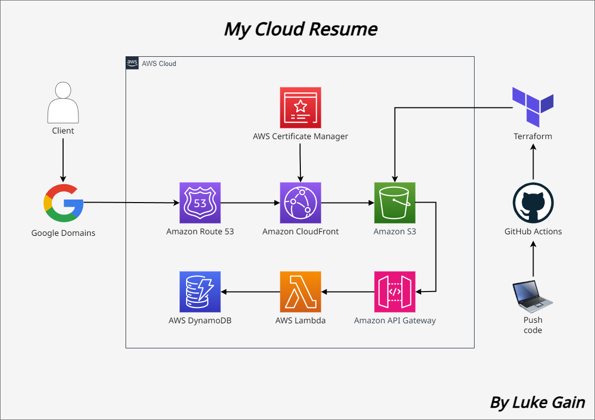

# The Cloud Resume Challenge

This is my personal website, built using AWS services as part of the [Cloud Resume Challenge](https://cloudresumechallenge.dev/docs/the-challenge/aws/), accessible at [lgain.dev](https://lgain.dev/).

### Architecture Overview
<ul>
<li>The static site was created with HTML, styled with CSS, and deployed to an S3 bucket.</li>
<li>Google Domains DNS directs requests to Route 53 DNS, which, in combination with CloudFront CDN and ACM, issues a TLS/SSL certificate that allows for HTTPS connections.</li>
<li>The website displays a visitor counter. Upon page load, a JavaScript function calls a REST API Gateway endpoint using an HTTP POST method, which runs a Lambda function written in Python with the boto3 library.</li>
<li>The Lambda function increases the visitor count value stored in a DynamoDB database, and returns the new total which is displayed on the page.</li>
<li>Upon pushing changes to the main branch, GitHub Actions will automatically deploy infrastructure with Terraform, sync the updated files with S3, and invalidate the CloudFront cache (CI/CD).</li>
</ul>